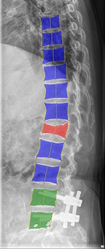

# Vertebral Facture Detection Based On Machine Learning Method

Our aim is to detect if each vertebra in a given X-ray image is fractured, here we try to identify if *Thoracic* and *Lumbar* is fractured by ML/DL model. The data we used for training model is provided by National Cheng Kung University Hospital, Taiwan, Tainan. This is my bachelor project and is instructed by professor Sun-Yuan Hsieh from National Chen Kung University, department of Computer Science.

# Description

In this project we will use both machine learning and deep learning method. Deep learning method is mainly for detecting and segmentation of vertebra, then we will extract some critical information form the result of segmentation, these information are taken to be the feature for our machine learning method to identify if the vertebra is fractured, screwed or normal.

# Process Flow

1. Labeling Data   
manually label data with twelve-sided polygon for each vertebra.   
each vetebra labeled with its position (T1-T12, L1-L5, S)   

2. Object Detection for Vertebra using yolov5 model   

3. Image segmentation for Vertebra using Unet model   

4. Feature Extraction, from the image segmentation result find the four corner of the vertebra and calculate the length of left, right and middle part   

5. Data Analysis, try to find some useful imformation by plotting the distribution of feature of labeled data   

6. Detection, train ML model from feature obtained in step 4, here we try three method including DecisionTree, RandomForest and KNN, for each vertebra detected, extract feature and predict the result (normal, screw or fractured)

# Demo Image

there are three color blue, green and red represent normal, screwed and fractured respectively.  
the following examples are from RandomForest algorithm
- 01549476_FILE5.jpg  
  
- 01990231_FILE3.jpg  
  
- 03877078_FILE2.jpg  
  
